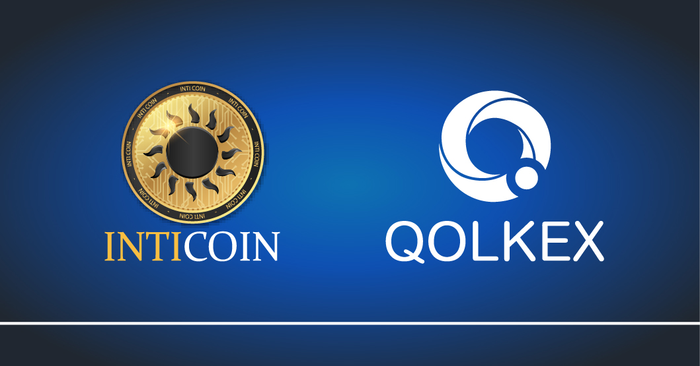

INTICOIN - INTI

INTICOIN is from some X11 PoW / PoS. It is a coin that is integrated with real functions of super extra random blocks. Your distribution of coins to the community is discreet but high POS.

X11 hash algorithm, mixed PoW / PoS
7 confirmations of transactions in deposits
20 confirmations in mined POS / POW
The total of coins will be 115 million.
The coin will be a pure PoS currency after the 1 million block and the PoW will be eliminated.
A 25% bonus for rewards and to finance servers and development expenses.

```
### POS (PROOF-OF-STAKE) Reward

block 0 - 30000 = 30%
block 30001 - 60000 = 25%
block 60001 - 90000 = 20%
block 90001 - 120000 = 15%
block 120001 - forever = 5%


### Max Supply raised to 115 000 000

PORT: 
default: 55883 or testnet: 45883
RPCPORT:
default: 55884 or testnet: 45884
